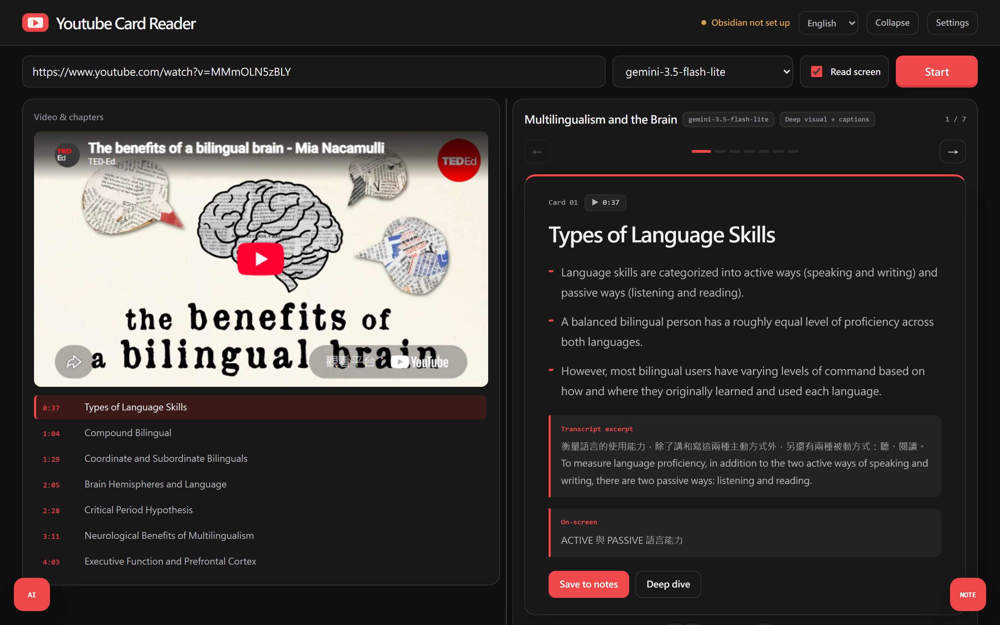
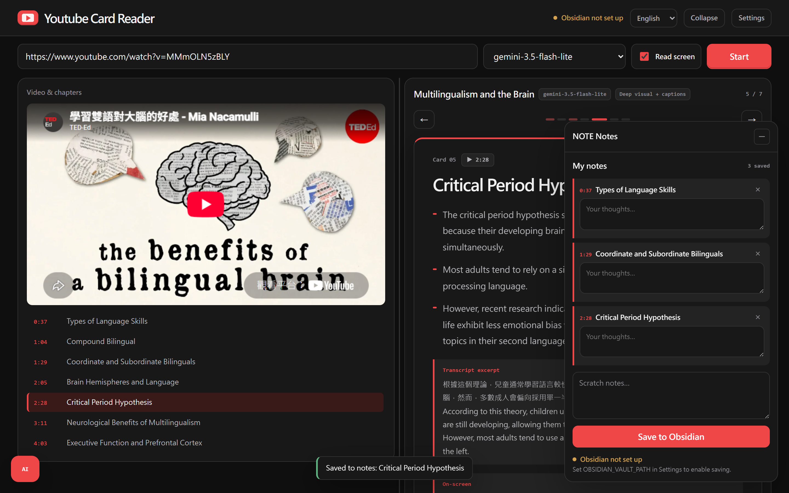
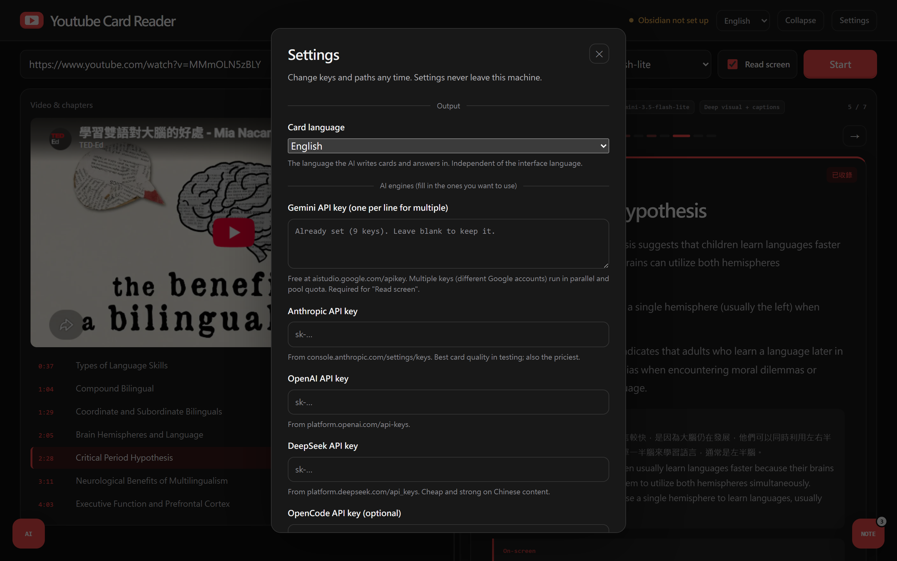
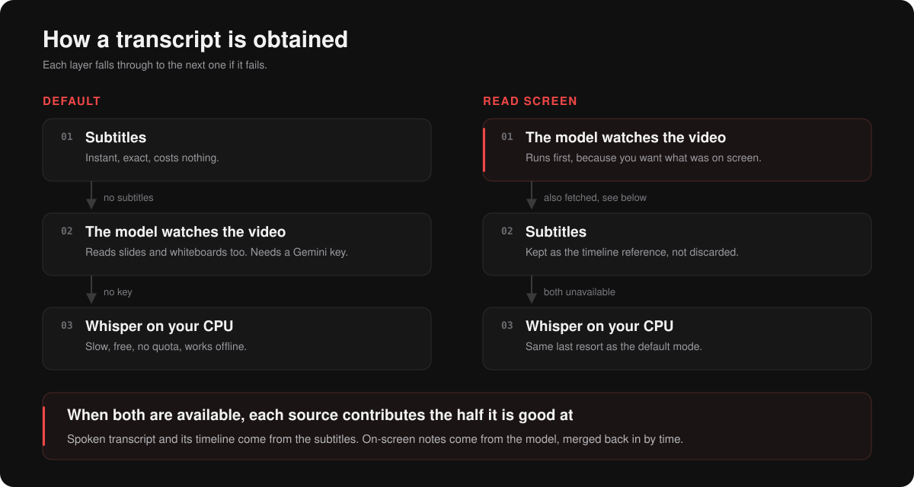

# Youtube Card Reader

Turn any YouTube video or web article into a deck of timestamped knowledge cards you can flip
through, jump back into, ask questions about, and file away in Obsidian.


*The full 25 second walkthrough, with sound: [docs/promo-en.mp4](docs/promo-en.mp4)*

Paste a link, press Start. The app fetches a transcript, splits the content into cards, and puts
the video on the left and the cards on the right. Every card carries the timestamp it came from,
so a card is never a dead summary: click the time and the video jumps to the exact moment.

It runs entirely on your machine. No account, no server of ours, no telemetry. It works with no
API key at all, because the default text engine is a set of free models.

---

## Features

- **Cards, not a wall of summary.** Each card is one idea: a heading, three bullet points, the
  verbatim line from the transcript it came from, and what was on screen at that moment.
- **Timestamps that actually land.** Click the time on a card to jump the player there. See
  [How it works](#how-it-works) for why this is harder than it sounds and what the app does about it.
- **Reads the screen, not just the audio.** Turn on "Read screen" and the model watches the video
  itself, so slides, whiteboards, and on-screen code end up in the cards even though nobody read
  them out loud.
- **Ask the video.** A chat panel that has already read the whole transcript, so you can ask
  follow-up questions about anything that was said.
- **Go deeper on one card.** "Deep dive" re-runs a single card with a longer explanation.
- **Save to Obsidian.** Collect the cards you care about and write them into your vault as one
  Markdown note.
- **Five engines.** Gemini, Claude, GPT, DeepSeek, and OpenCode Zen free models, switchable from a
  dropdown, plus an auto mode with fallback.
- **Bilingual interface, six output languages.** The UI reads in English or Traditional Chinese;
  the cards can be written in any of six languages. The two settings are independent.





---

## Quick start

Requires **Python 3.10+** and **Node.js 18+**. Nothing else.

```bash
git clone https://github.com/chang416/youtube-card-reader.git
cd youtube-card-reader
./scripts/start.sh
```

On Windows:

```powershell
powershell -ExecutionPolicy Bypass -File scripts\start.ps1
```

Or just double-click `start.command` (macOS) or `start.bat` (Windows).

The first run creates a Python virtual environment and installs packages, which takes a few
minutes. After that it starts in a couple of seconds. When it is up, the browser opens at
`http://127.0.0.1:15273`.

To stop it: `./scripts/stop.sh`, or close the two terminal windows on Windows.

---

## Configuration

Every key is optional. With an empty configuration the app still summarizes videos that have
subtitles, using the free OpenCode Zen models.



There are two places to put configuration, and they are read in this order:

1. **The Settings dialog in the app** (the gear icon). Writes `settings.json` next to the backend.
   Takes effect immediately, no restart.
2. **A `.env` file** in the project root. Copy `.env.example` and fill in what you want.

Both files are in `.gitignore`.

### Supported engines

| Engine | Default model | Free? | Key from |
|---|---|---|---|
| OpenCode Zen | `deepseek-v4-flash-free` | Yes, no key needed | https://opencode.ai/zen |
| Google Gemini | `gemini-3.5-flash-lite` | Free tier | https://aistudio.google.com/apikey |
| Anthropic Claude | `claude-opus-5` | No | https://console.anthropic.com/settings/keys |
| OpenAI | `gpt-5.1` | No | https://platform.openai.com/api-keys |
| DeepSeek | `deepseek-chat` | No | https://platform.deepseek.com/api_keys |

Notes:

- **Gemini is the one key that unlocks a feature rather than just a model.** "Read screen" and
  web search in the ask panel both need it. Everything else works without it.
- **Multiple Gemini keys are supported.** Put one per line, or comma-separated. Their free-tier
  quotas add up, and long videos are split across them in parallel.
- **The model dropdown lists what you actually have.** When a key is present the app asks that
  provider for its real model list; otherwise it shows a small built-in list.
- **Auto mode** runs the free chain first, then falls back to whichever paid providers you have
  configured, in the order Gemini, DeepSeek, OpenAI, Anthropic.

### Obsidian

Set `OBSIDIAN_VAULT_PATH` to your vault and `OBSIDIAN_NOTES_FOLDER` to the folder inside it.
Leave the path empty to hide the save button.

---

## How it works

Getting a transcript is a waterfall. Each layer falls through to the next one if it fails.



**Default:** subtitles first, because they are instant, free, and exact. If the video has none,
the model watches the video. If there is no Gemini key either, Whisper runs locally on your CPU:
slow, but free and unlimited.

**Read screen mode** flips the first two: the model watches the video even when subtitles exist,
because you want what was on the slides, not just what was said.

### Why "read screen" mode also fetches the subtitles

This is the part worth knowing about, and it is why the badge above the cards says
"Deep visual + captions" rather than just "Deep visual".

When a model watches a video, the timestamps it reports for what it sees on screen are accurate,
but the timestamps it reports for speech drift. Measured against the official subtitles of a
5-minute TED-Ed video:

| Reported | Actual | Error |
|---|---|---|
| 0:17 | 0:18 | -1s |
| 1:11 | 1:01 | +10s |
| 2:26 | 1:50 | +36s |
| 3:22 | 2:25 | +57s |
| 4:54 | 3:16 | +98s |

The drift is monotonic: perfect at the start, a minute and a half off at the end. Worse, the
model had transcribed only the first 196 seconds of a 283-second video and then stretched that
content to fill the runtime, so the last 90 seconds were missing entirely.

The on-screen notes from the same response, meanwhile, were within 3 seconds of the truth.

So the app takes the accurate half of each source. When subtitles exist, the spoken transcript
and its timeline come from the subtitles; the on-screen notes come from the model and are merged
into the correct positions by time. After the fix, the transcript matches the official subtitles
line for line, runs to the true 283 seconds, and all 20 on-screen notes survive.

### Prompt language

The prompt is written in Traditional Chinese and stays that way in every language. This is
deliberate, not an oversight. The extraction criteria in it were tuned against real output, and
translating them means re-tuning quality from scratch. Instead, output language is a hard
directive pinned to the top of the prompt: read the instructions in one language, answer in
another. Adding a language is one row in `backend/app/core/languages.py`.

Available output languages: Traditional Chinese, Simplified Chinese, English, Japanese, Korean,
Spanish.

**Interface language and output language are separate settings.** Switching the UI to English does
not make the cards English, and vice versa.

---

## Ports

Backend `8420`, frontend `15273`. Deliberately uncommon, so the app does not collide with whatever
else is running on `8000` or `5173`.

To change them:

```bash
YCR_BACKEND_PORT=9000 YCR_FRONTEND_PORT=9001 ./scripts/start.sh
```

The frontend finds the backend through `VITE_API_BASE`, which the start scripts set for you.

---

## Project layout

```
backend/app/
  api/          summarize (streaming), ask, models, notes, settings
  llm/          gemini, opencode, openai_compat (OpenAI + DeepSeek),
                anthropic_api, router (routing and fallback)
  transcript/   captions, deepsrt, whisper_local, router (the waterfall), cache
  prompts/      summarize (extraction criteria), ask
  core/         config (layered settings), languages, zh (script normalization)
frontend/src/
  components/   CardDeck, VideoPane, NotesPanel, AskPanel, FloatingPanel,
                Splitter, SettingsModal, BrandMark, MarkdownText
  hooks/        useSummarizeStream, useCards, useModels, useNotesVault, useSettings
  i18n/         strings (en / zh), provider
scripts/        start.sh, stop.sh, start.ps1
```

Python changes need a backend restart. The frontend hot-reloads.

---

## Testing

Three test files, none of which touch the network or need a key. External calls are injected fakes.

```bash
cd backend
PYTHONPATH=. .venv/bin/python tests/test_deepsrt.py
PYTHONPATH=. .venv/bin/python tests/test_progress_stream.py
PYTHONPATH=. .venv/bin/python tests/test_providers.py
```

On Windows, use `.venv\Scripts\python.exe`. They are also pytest-compatible, and CI runs them on
every push along with a frontend build.

---

## Contributing

See [CONTRIBUTING.md](CONTRIBUTING.md) for how to add an engine, a UI language, or an output
language. Issues and pull requests are welcome.

## License

MIT. See [LICENSE](LICENSE).

## Acknowledgements

Built on top of lootube, the Chinese-only predecessor this project grew out of. Transcripts come
from `youtube-transcript-api`, local transcription from `faster-whisper`, and the free model chain
from OpenCode Zen.
